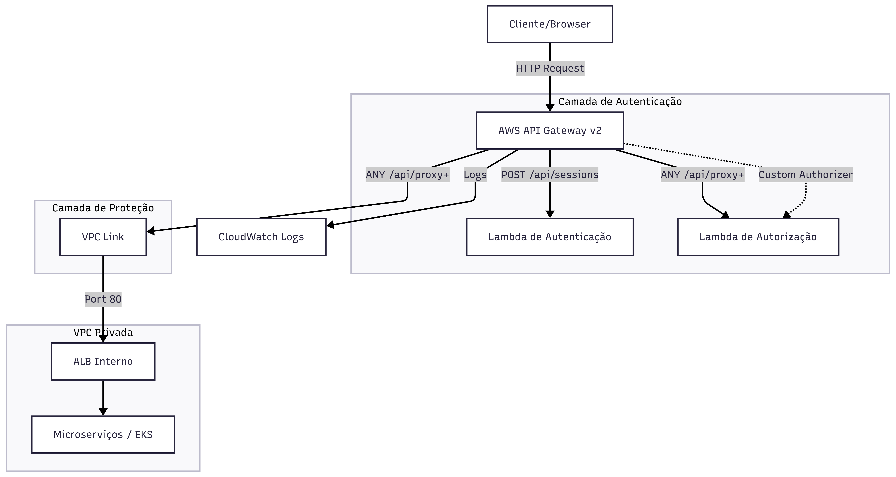

# IaC Tech Challenge - API Gateway

Este repositório contém a infraestrutura como código (IaC) para o provisionamento da camada de API Gateway do projeto Tech Challenge. Ele atua como o ponto de entrada único para os microserviços, gerenciando autenticação, autorização e o roteamento de tráfego para os recursos internos da VPC através de um VPC Link.

## 🛠️ Tecnologias Utilizadas

*   **Terraform:** Orquestração e provisionamento da infraestrutura.
*   **AWS API Gateway v2 (HTTP API):** Gerenciamento de APIs de baixo custo e alta performance.
*   **AWS Lambda:** Integrações para autenticação e autorização customizada.
*   **LocalStack:** Emulação de serviços AWS para desenvolvimento e testes locais.
*   **AWS VPC Link:** Conexão segura entre o API Gateway e recursos privados (ALB).

## 🚀 Passos para Execução e Deploy

### Pré-requisitos

*   Terraform (v1.0+) instalado.
*   AWS CLI configurado.
*   LocalStack instalado (para execução local).
*   [tflocal](https://github.com/localstack/terraform-local) instalado (recomendado para LocalStack).

### Execução Local (via LocalStack)

1.  Inicie o LocalStack em segundo plano:
    ```bash
    localstack start -d
    ```
2.  Navegue até o diretório `localstack`:
    ```bash
    cd localstack
    ```
3.  Inicialize o Terraform:
    ```bash
    tflocal init
    ```
4.  Aplique o plano de infraestrutura:
    ```bash
    tflocal apply
    ```

### Deploy Real na AWS

1.  Certifique-se de que suas credenciais da AWS estejam configuradas (ex: via AWS Academy).
2.  Navegue até o diretório `aws`:
    ```bash
    cd aws
    ```
3.  Inicialize o Terraform (configurado com backend S3 para o estado):
    ```bash
    terraform init
    ```
4.  Revise as alterações planejadas:
    ```bash
    terraform plan
    ```
5.  Aplique o deploy na AWS:
    ```bash
    terraform apply
    ```

> **Nota:** O provisionamento na AWS depende de recursos pré-existentes (VPC, Subnets e Lambdas de Autenticação) que são identificados automaticamente via `data sources` com a tag `Project: tech-challenge`.

## 📐 Diagrama da Arquitetura



## 📡 APIs (Swagger/Postman)

*(em branco)*
